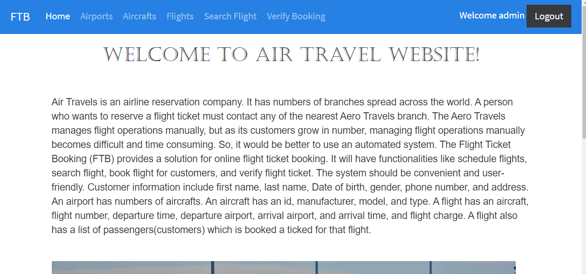

# FlightBookingSystem

## Project status: On going

## Author: Md Jahirul Islam
## Email: miakanchon5100@gmail.com

## Technology:
Booking flight ticket system written by java spring boot framework
Flight Booking 

1- Framework: Spring Boot 
2- Database: MySQL

Hibernate, Thymeleaf, Spring Boot Security, Thymeleaf Dialect, JPA

Roles:
1-Admin: username=admin, password:, Add/Remove flight, airplain, and aircraft, search flight, verfity ticket
2-Agent: username=agent, password:, Book/Cancel ticket for passengers, search flight, verfity ticket

## 
Feature of Projects

## Login Page

## Home Page

## List of Airport

## List of Aircraft

## List of Flight

## Booking Flight

## Veryfy flight

